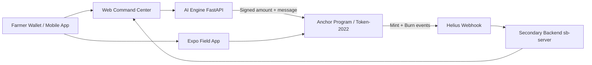

# Root-Chain

The Solana-powered protocol for verified, high-liquidity carbon sequestration.

## How It Works

1. Farmers register land and create a farm account PDA.
2. AI oracle calculates biomass change from NDVI mock data and signs the mint payload.
3. Solana program verifies oracle signature (via Ed25519 verification instruction) and mints Token-2022 carbon credits.
4. Buyers retire credits, triggering on-chain `CarbonRetired` events.
5. Secondary backend ingests webhook events, updates global carbon metrics, and broadcasts live feed updates.

## Architecture Diagram



## Monorepo Structure

- `sol-program`: Anchor Solana program.
- `ai-engine`: FastAPI biomass oracle + signing API.
- `sb-server`: Express + Socket.IO event indexer.
- `sol-dapp-web`: Next.js command center + Solana Actions endpoints.
- `sol-dapp-app`: Expo mobile field registration app.

## Local Setup

### 1) Solana Program

```bash
cd sol-program
cargo check
anchor build
```

### 2) AI Engine

```bash
cd ai-engine
python -m venv .venv
# activate venv
pip install -r requirements.txt
cp .env.example .env
uvicorn app:app --reload --port 8000
```

### 3) Secondary Backend

```bash
cd sb-server
npm install
cp .env.example .env
npm run build
node dist/index.js
```

### 4) Web Command Center

```bash
cd sol-dapp-web
npm install
cp .env.example .env.local
npm run dev
```

### 5) Mobile Field App

```bash
cd sol-dapp-app
npm install
cp .env.example .env
npm run start
```

## Key Endpoints

- AI Engine:
    - `POST /calculate`
    - `POST /verify-biomass`
- Secondary Backend:
    - `GET /server/health`
    - `GET /metrics/global-offset`
    - `POST /webhooks/solana`
- Web Actions:
    - `GET /api/actions/retire`
    - `POST /api/actions/retire`
    - `GET /api/health`

## Deployment Script

At repo root:

```bash
./deploy.sh <PROGRAM_ID>
```

The script builds and deploys the Anchor program on Devnet and updates Program ID references in app env files.